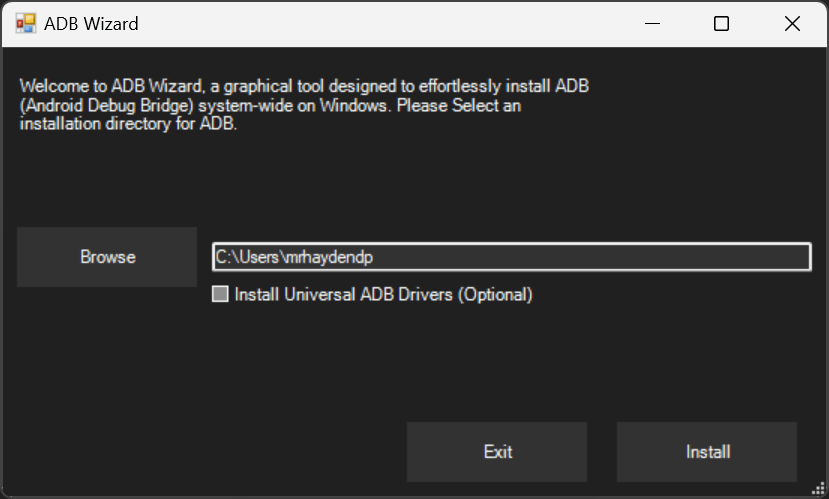

# ADB-Wizard (W.I.P)
A graphical tool designed to effortlessly install ADB (Android Debug Bridge) system-wide on Windows.

## Features
- Uninstall/install ADB
- Access ADB from anywhere
- ADB Updater
- Install [Universal ADB Driver](https://adb.clockworkmod.com/) (optional)



## How to Run
Paste this command into Windows Terminal/Powershell (Admin)
``` powershell
iwr "https://github.com/mrhaydendp/adb-wizard/raw/main/ADB%20Wizard.ps1" | iex
```
Or, download `ADB Wizard.ps1` and run locally
