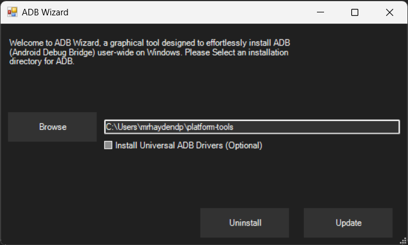
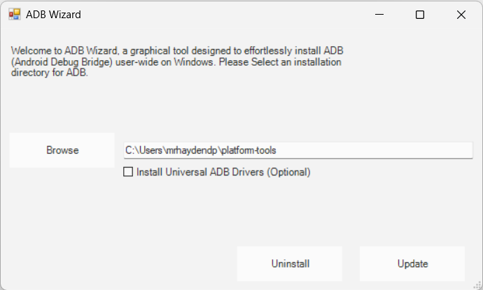

# ADB Wizard
A graphical tool designed to effortlessly install ADB (Android Debug Bridge) user-wide on Windows.

## Features
- Uninstall/install ADB
- Access ADB user-wide
- Update ADB
- Install [Universal ADB Driver](https://adb.clockworkmod.com/) (optional)

Dark | Light
:---:|:-----:
|

## How to Run
Paste this command into Windows Terminal/Powershell:
``` powershell
iwr "https://github.com/mrhaydendp/adb-wizard/raw/main/adb-wizard.ps1" | iex
```
Or, download `adb-wizard.ps1` and run locally
